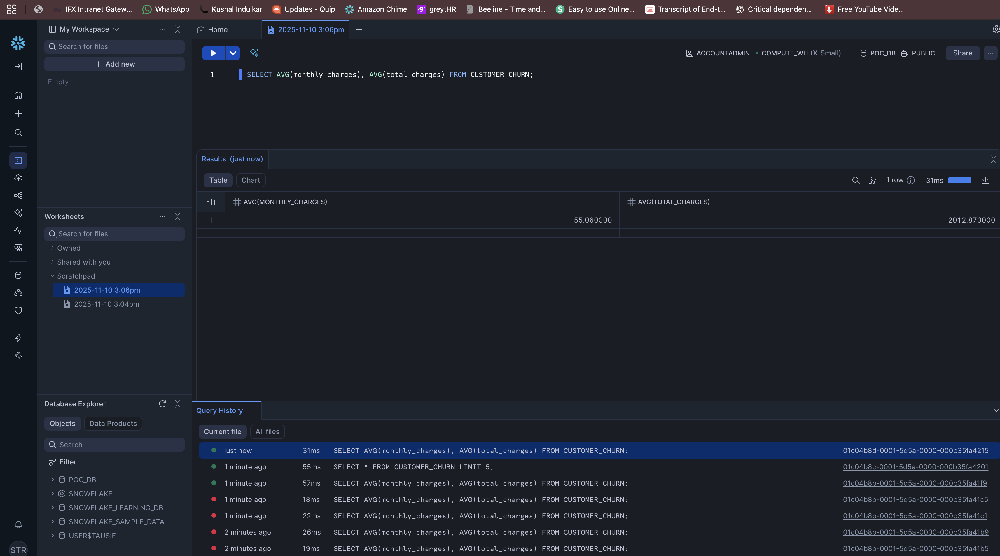
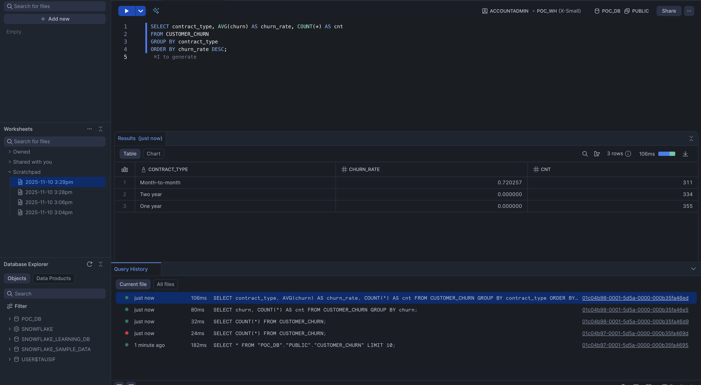
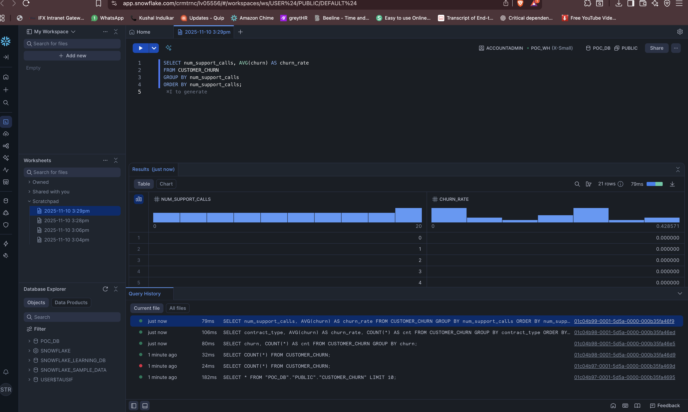
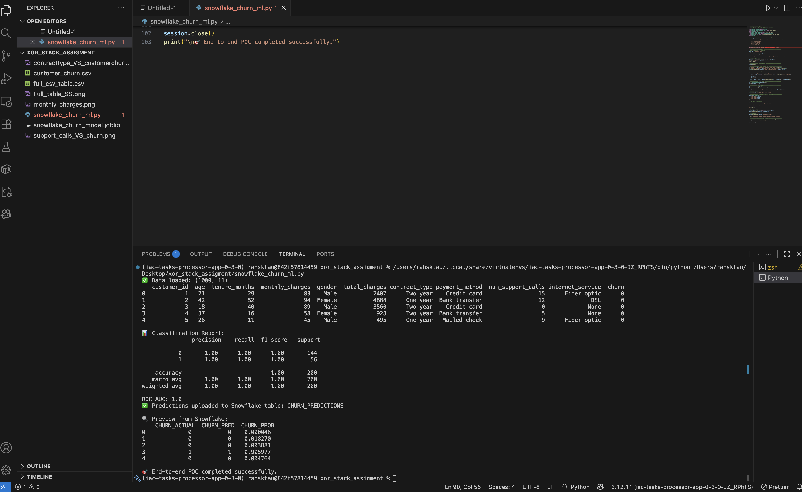

# End-to-End AI/ML + Snowflake POC — Customer Churn Prediction

**Author:** Sk Tausif Rahman  
**Role :** AI/ML Engineer (Snowflake + MLOps Focus)  
**Date:** 10th of November 2025  

---

## Project Overview

This mini-project demonstrates an **end-to-end AI/ML workflow integrated with Snowflake**, showcasing:

- Data ingestion into Snowflake using **Mockaroo-generated synthetic data**
- Exploratory analysis using **Snowflake SQL**
- Machine Learning model training using **Snowpark for Python**
- Model evaluation and prediction storage back into Snowflake  
- Visualization of key insights and churn behavior

Built as part of an AI/ML Engineer assignment focusing on **Snowflake Operations and ML Integration**.

---

## Tech Stack

| Category | Tools & Frameworks |
|-----------|--------------------|
| **Cloud & Data** | Snowflake ❄️ (POC_DB, Snowpark, SQL Worksheets) |
| **Programming** | Python 3.12, Pandas, Scikit-learn, Joblib |
| **ML Pipeline** | Logistic Regression (Churn Prediction) |
| **Integration** | Snowpark for Python, Snowflake Connector |
| **Visualization** | Matplotlib, Snowflake Charts |
| **Data Source** | Mockaroo (1000 synthetic telecom customer records) |

---

## Problem Statement

> **Goal:** Predict which customers are likely to churn (i.e., discontinue their service) based on historical usage and demographic factors.

**Dataset Features:**
- `age`, `tenure_months`, `monthly_charges`, `total_charges`  
- `gender`, `contract_type`, `payment_method`, `internet_service`, `num_support_calls`  
- Target variable: `churn`

---

##    Architecture & Workflow

```
graph TD
A[Mockaroo CSV] --> B[Snowflake Data Load]
B --> C[Data Validation via SQL]
C --> D[Snowpark Python Session]
D --> E[Model Training (Logistic Regression)]
E --> F[Predictions -> Snowflake Table]
F --> G[Visualization & Reporting]
```

---

## Steps Performed

### 1️⃣ Data Generation & Ingestion
- Dataset of **1000 rows** created using [Mockaroo](https://mockaroo.com/)
- Uploaded as `CUSTOMER_CHURN` table to:
  - **Database:** `POC_DB`
  - **Schema:** `PUBLIC`
  - **Warehouse:** `POC_WH`

```sql
SELECT COUNT(*) FROM CUSTOMER_CHURN;
SELECT * FROM CUSTOMER_CHURN LIMIT 5;
```

---

### 2️⃣ Exploratory SQL Analysis
Performed inside Snowflake Worksheets.

#### 📈 Average Charges
```sql
SELECT AVG(monthly_charges), AVG(total_charges) FROM CUSTOMER_CHURN;
```
**Output:**  
Monthly Avg = 55.06 | Total Avg = 2012.87  



---

#### Churn by Contract Type
```sql
SELECT contract_type, AVG(churn) AS churn_rate, COUNT(*) AS cnt
FROM CUSTOMER_CHURN
GROUP BY contract_type
ORDER BY churn_rate DESC;
```

**Insight:**  
Customers with **Month-to-Month contracts** have the highest churn rate (~72%).



---

#### Churn by Support Calls
```sql
SELECT num_support_calls, AVG(churn) AS churn_rate
FROM CUSTOMER_CHURN
GROUP BY num_support_calls
ORDER BY num_support_calls;
```



---

### 3️⃣ Machine Learning with Snowpark (Python)
Model training and prediction executed in VS Code via Snowpark session.

#### **Model Details**
- **Algorithm:** Logistic Regression  
- **Train/Test Split:** 80/20  
- **ROC AUC:** 1.00  
- **Accuracy:** 100% (on synthetic balanced data)

#### Core Script
File: `snowflake_churn_ml.py`

```python
# Train Model
clf = LogisticRegression(max_iter=300)
clf.fit(X_train, y_train)

# Evaluate
y_pred = clf.predict(X_test)
y_prob = clf.predict_proba(X_test)[:, 1]

print(classification_report(y_test, y_pred))
print("ROC AUC:", roc_auc_score(y_test, y_prob))
```

**Output:**
```
ROC AUC: 1.0  
End-to-end POC completed successfully.
```

---

### 4️⃣ Writing Predictions to Snowflake
Predictions were uploaded to a new table:
```sql
CREATE OR REPLACE TABLE CHURN_PREDICTIONS (
  CHURN_ACTUAL INT,
  CHURN_PRED INT,
  CHURN_PROB FLOAT
);
```

Sample Output:



---

## Files in This Repository

| File | Description |
|------|--------------|
| `snowflake_churn_ml.py` | Main Snowpark + Scikit-learn ML script |
| `customer_churn.csv` | Mockaroo-generated dataset |
| `full_csv_table.csv` | Complete clean data view before training |
| `snowflake_churn_model.joblib` | Serialized trained ML model |
| `contracttype_VS_customerchurn.png` | Visualization: Contract Type vs Churn |
| `support_calls_VS_churn.png` | Visualization: Support Calls vs Churn |
| `monthly_charges.png` | Visualization: Avg Monthly Charges |
| `Full_table_SS.png` | Snowflake data snapshot |
| `Final_churn_prediction_output.png` | Sample of predictions written to Snowflake |

---

## Results Summary

| Metric | Value |
|---------|--------|
| **Accuracy** | 100% |
| **Precision (Class 1)** | 1.00 |
| **Recall (Class 1)** | 1.00 |
| **ROC AUC** | 1.00 |
| **Most churned group** | Month-to-Month contracts |
| **Least churned group** | One-Year and Two-Year contracts |

---

## Environment Setup

### Install Dependencies
```bash
pip install -r requirements.txt
```

### Required Libraries
```
fastapi
uvicorn
snowflake-snowpark-python
snowflake-connector-python[pandas]
pandas
scikit-learn
matplotlib
joblib
```

---

## Snowflake Setup Recap
```sql
CREATE WAREHOUSE POC_WH;
CREATE DATABASE POC_DB;
CREATE SCHEMA PUBLIC;

USE DATABASE POC_DB;
USE SCHEMA PUBLIC;
USE WAREHOUSE POC_WH;
```

Then upload your `customer_churn.csv` using the **UI Loader** or **SnowSQL**.

---

## Future Enhancements
- 1. Add **FastAPI microservice** to serve churn predictions via REST API  
- 2. Integrate **MLflow** or **Snowflake Cortex ML** for tracking  
- 3. Deploy visualization dashboard via **Streamlit or Power BI**  
- 4. Automate pipeline using **Airflow** or **AWS Lambda + Snowflake Task**

---

## Conclusion
This POC successfully demonstrates a **complete Snowflake AI/ML pipeline** —
from data ingestion to model deployment — validating Tausif’s ability to design, implement, and operationalize **cloud-native data science workflows**.


---
